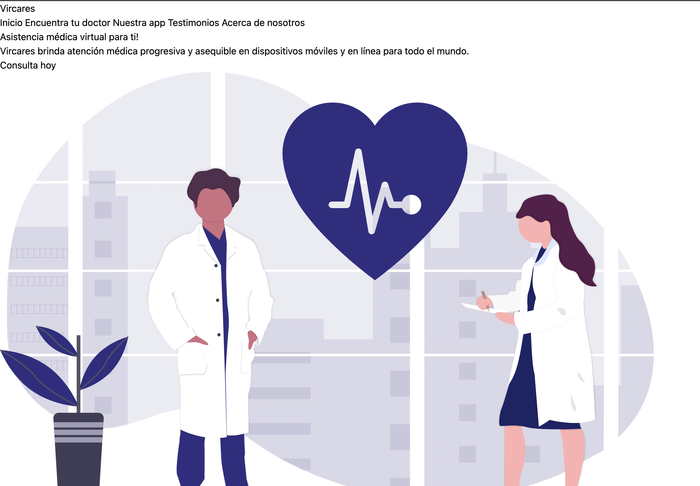
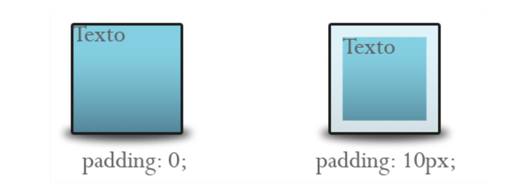

Guía para la sesión práctica del equipo Bagan explicado con peras y manzanas para poder aprobar la materia.

#### Pasaremos de esto: 

#### A esto: 

## ¡IMPORTANTE!

Antes de comenzar es necesario diferenciar dos conceptos que suelen confundirse con regularidad ya que los estaremos utilizando con frecuencia durante la sesión.

#### Padding y Margin 

**Padding**: El área de padding es el espacio entre el contenido del elemento y su borde

**Margin**: Es el espacio entre un elemento y los elementos adyacentes

### 1. Body

**body**: Para las pantallas de escritorio usaremos la etiqueta **pt-10** que nos incluirá un padding top equivalente a 40 px. 

Para personalizar la estructura de nuestro página usaremos dos media queries; uno utilizara un padding top de 14 y un padding x de 3 y el otro solo necesita un padding x de 36 que será la mejor opción para dispositivos móviles.

#### Resultado del elemento Body:

<body class="pt-10 lg:pt-14 px-3 lg:px-36">

### 2. Nav 

Dentro de la barra de navegación encontramos el nombre de la empresa y los elementos necesarios para navegar por la página.

**nav**: Centraremos todos los elementos y les daremos el espaciado correspondiente con las etiquetas **flex items-center justify-between**

#### Resultado del elemento nav:

<nav class="flex items-center justify-between">

**p**: Al nombre de la empresa le daremos un tamaño de 2xl, estará en negritas y le pondremos un color índigo con las etiquetas **text-2xl  font-bold text-indigo-800**

#### Resultado del elemento p:

Vircares

**div**: Nuestra barra de navegación se ocultará cuando la pantalla sea para la de un dispositivo móvil y utilizaremos **hidden** para lograr esto; mientras que para pantallas mayores la posicionaremos de manera horizontal con un espaciado entre sí de 8 con las etiquetas **md:flex md:gap-8***

#### Resultado del elemento div:

#### Resultado final del Nav:
<nav class="flex items-center justify-between">
    
Vircares

    

      <a href="/">Inicio</a>
      <a href="#">Encuentra tu doctor</a>
      <a href="#">Nuestra app</a>
      <a href="#">Testimonios</a>        
      <a href="#">Acerca de nosotros</a>
    

</nav>

### 3. Main

**Main**: Tendrá un margin top para ordenadores de tamaño 48 px y lo haremos posible con la etiqueta **mt-12** y para pantallas más pequeñas utilizaremos un media query con un margin top de 112 px **md:mt-28**.

Cuando tenemos varios elementos que necesitamos modificar de manera tanto vertical y horizontal utilizamos grid en vez de flex y en este caso utilizamos **grid grid-cols-1 md:grid-cols-2**.

#### Resultado del elemento main:
<main class="mt-12 md:mt-28 grid grid-cols-1 md:grid-cols-2">

**div**: Nuestro contenedor se compone del título, descripción y botón; necesitamos el estilo flex pero dirigido a las columnas para poder ordenarlos y alinearlos al centro con un espaciado de ocho y lo logramos con las etiquetas **flex flex-col gap-8 justify-center**.

#### Resultado del elemento div:

**h**: Nuestro título tendrá un tamaño de 36 px y estará en negritas y por ello utilizamos los estilos **text-4xl font-bold**.

#### Resultado del elemento h1:
<h1 class="text-4xl font-bold leading-tight">Asistencia médica virtual para ti!</h1>

**p**: Nuestro párrafo tendrá un tamaño de 18 px y será de color gris gracias a las etiquetas **text-lg text-gray-500**

#### Resultado del elemento p:

        Vircares brinda atención médica progresiva y asequible
        en dispositivos móviles y en línea
        para todo el mundo.

**a**: Nuestro botón tendrá el texto color blanco y centrado; mientras que la estructura será de color indigo, con bordes de 24 px y con un padding personalizado y se logra con los siguientes estilos **text-white text-center bg-indigo-800 rounded-3xl py-2.5 md:w-40**
 
#### Resultado del elemento a:
<a href="#" class ="text-white text-center bg-indigo-800 rounded-3xl py-2.5 md:w-40">Consulta hoy</a>

**img**: Nuestra imagen tendrá un padding top de 64 px **pt-16 md:pt-0**

#### Resultado del elemento img:

### Resultado Final:

<body class="pt-10 lg:pt-14 px-3 lg:px-36">
  <nav class="flex items-center justify-between">
    
Vircares

    

      <a href="/">Inicio</a>
      <a href="#">Encuentra tu doctor</a>
      <a href="#">Nuestra app</a>
      <a href="#">Testimonios</a>        
      <a href="#">Acerca de nosotros</a>
    

  </nav>
  
  <main class="mt-12 md:mt-28 grid grid-cols-1 md:grid-cols-2">
    

      <h1 class="text-4xl font-bold leading-tight">Asistencia médica virtual para ti!</h1>
      

        Vircares brinda atención médica progresiva y asequible
        en dispositivos móviles y en línea
        para todo el mundo.
      

      <a href="#" class ="text-white text-center bg-indigo-800 rounded-3xl py-2.5 md:w-40">Consulta hoy</a>
    

    
  </main>
  </body>
</html>

